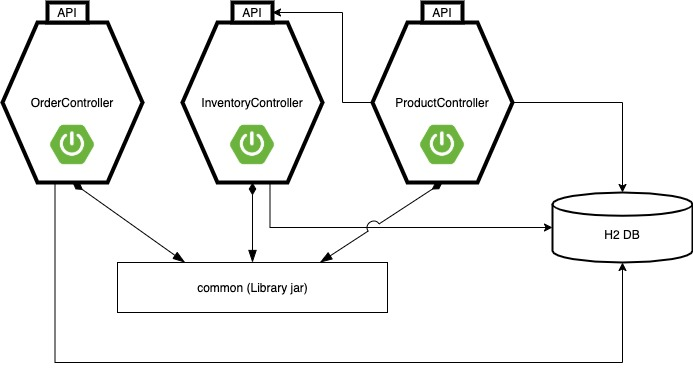

# OMS Services

This folder contains the resulting Spring Boot services of the OMS vFunction tutorial.

There are three services and one common library as seen in the figure below.

The services connect to an H2 database as a remote DB. 

The ProductController service is using the InventoryController API to fetch inventory data related to products

All services use the common library jar.

The file OMS Services.postman_collection.json contains can be imported into [Postman](http://postman.com) to test the services after they have been launced. See tutorial for details.